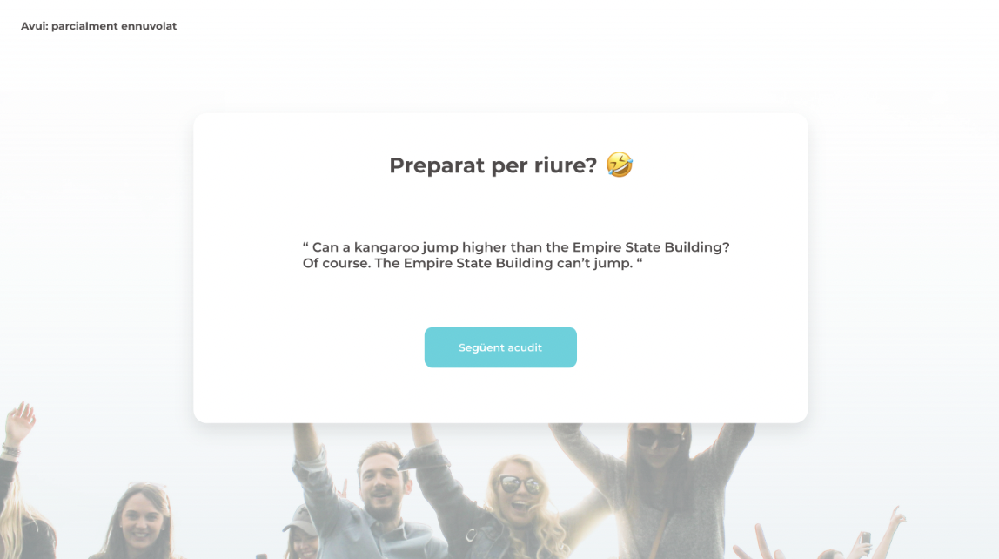
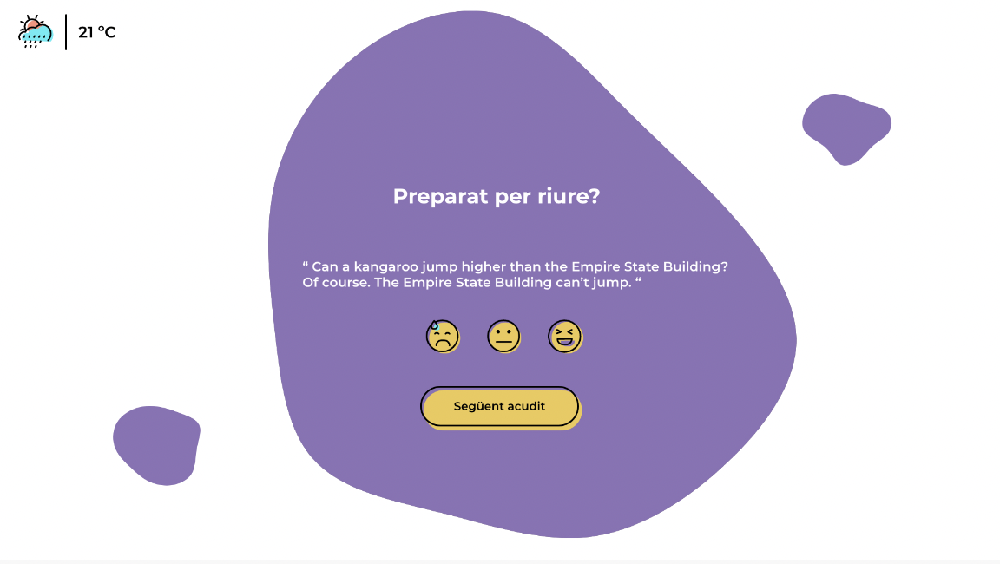

# BRIEF 😀 😃 😄

A coaching company is bringing an experiment to companies in Barcelona, ​​in which it is measuring the impact of humor and fun on productivity.

They have been asked for a web application that shows jokes to employees before starting the workday.

We will be in charge of carrying out the basis of the project to carry out a demo in two weeks with the client and start testing with real users.

Here are the instructions of the front end manager:

- It is mandatory to implement all loops and logic with ES6 (using map, reduce, filter and luck to manipulate arrays). In no case can you use the for loop.

- We can choose between Typescript or JasvaScript.

## 🥶 STEP 1

In this first exercise we will create the main screen that will display jokes to the user.

The operation should be as follows:

- When entering it will not show any joke. The title and the next joke button will appear.

- Pressing the "Next joke" button will fetch the jokes API and the joke in question will be displayed on the console.

## 🥵 STEP 2

Make a first approximation of the layout, placing each element in its place.

The objective of this step is that the user can visualize the jokes and ask for new ones.

A reference of the placement of the elements is as follows:

## 🥴 STEP 3

The company commissioning the project needs to monitor the use of this website for its study.

For this, it is necessary to know the level of acceptance of the jokes, a tracking to know when the employees are in a better mood, and how many jokes are consumed on average.

How is this request translated into our code?

We will use an array called reportAcudits, in which we will store all the information related to the joke that the client asks us for.

The three fields that we will take into account each object of the array are:

{

  joke: "...",

  resultado: 1,

  date: ...

}

The date of when the assessment was made must be saved in ISO format.

## 😥 STEP 4

Now that the website is designed to show jokes first thing in the morning so that we start the day well, we will add weather information, as it can be very useful.

Consume a weather information API and display it on the web. This API should be said on opening, not via a button.

## 🤗 STEP 5

We implemented the possibility of alternating different jokes.

We connect with another API.

## 📲 STEP 6 

Layout the jokes and weather website according to the following screen:

[Link](https://xavioli.github.io/Joke-App-Using-API/)

